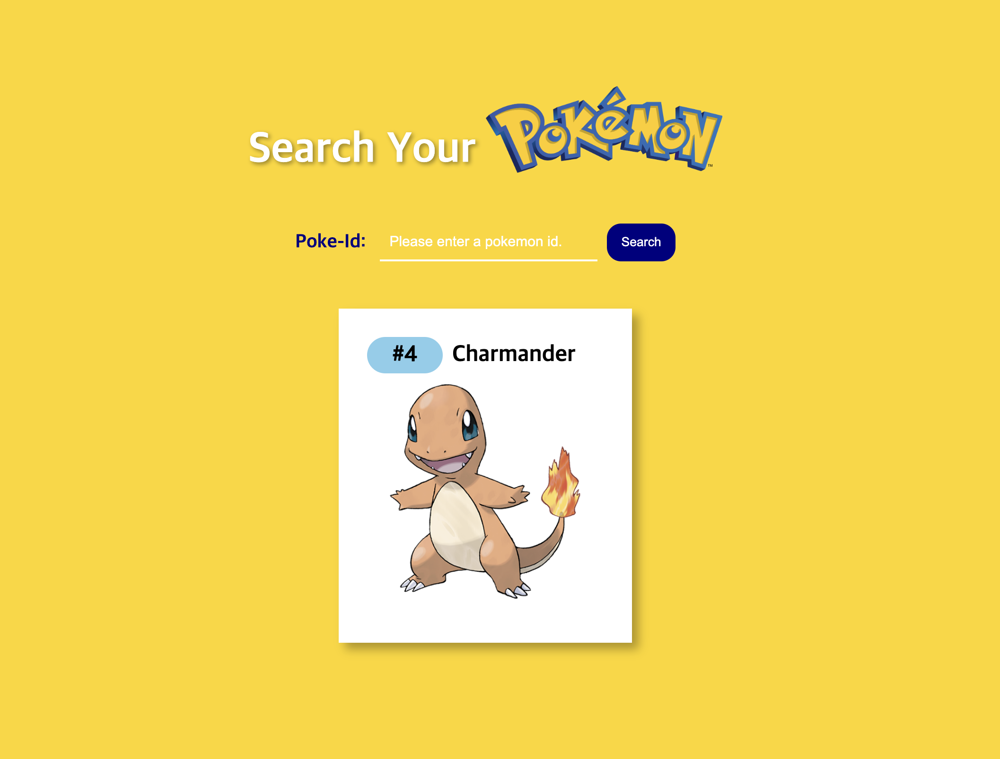

# 포켓몬 검색 도감

Poke API로 제작한 포켓몬 검색 도감으로 검색 시 이미지를 띠부띠부씰의 형태로 구현하였습니다.

## Table of contents

- [Overview](#overview)
  - [Features](#features)
  - [Screenshot](#screenshot)
  - [Links](#links)
- [My process](#my-process)
  - [Built with](#built-with)
  - [What I learned](#what-i-learned)
  - [Reference](#reference)
- [Author](#author)

## Overview

### Features

- 포켓몬 Id와 Name으로 검색 기능 구현
- Poke API 활용
- 검색 시 axios로 데이터 받아오기

### Screenshot

### Links

- Live Site URL: [https://thisisyeji.github.io/pokemon](https://thisisyeji.github.io/pokemon)

## My process

### Built with

- [React](https://reactjs.org/) - JS library
- SCSS
- HTML5

### What I learned

- Poke API 활용
- axios error 처리

### Reference

- [poke api](https://pokeapi.co/docs/v2#pokemon)

## Author

- Github - [김예지 Yeji Kim](https://github.com/thisisyeji)
